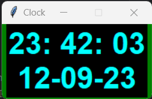

# digital-clock

A Digital Clock Written in Python

## License

Please see [Apache 2.0 License](./LICENSE) for details.

## Image

## References

Sanchhaya Education Private Limited. (2022, October 25). *Python | Create a digital clock using Tkinter*. Geeks for
Geeks’ Website; Sanchhaya Education Private
Limited. https://www.geeksforgeeks.org/python-create-a-digital-clock-using-tkinter/?ref=lbp