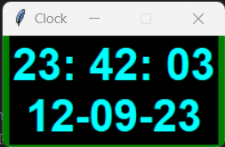

# digital-clock

Digital Clock written in Python

# License

Please see [Apache 2.0 License](./LICENSE) for details.

# Image

# References

Sanchhaya Education Private Limited. (2022, November 25). <i>Python | Create a digital clock using Tkinter</i>.
GeeksforGeeks. Retrieved December 9, 2023, from
https://www.geeksforgeeks.org/python-create-a-digital-clock-using-tkinter/?ref=lbp#
